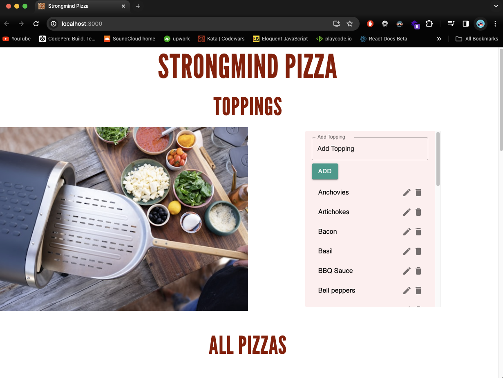
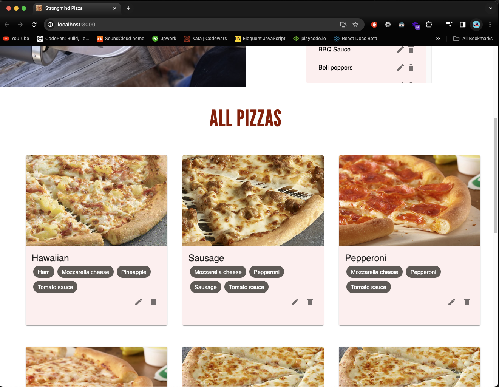
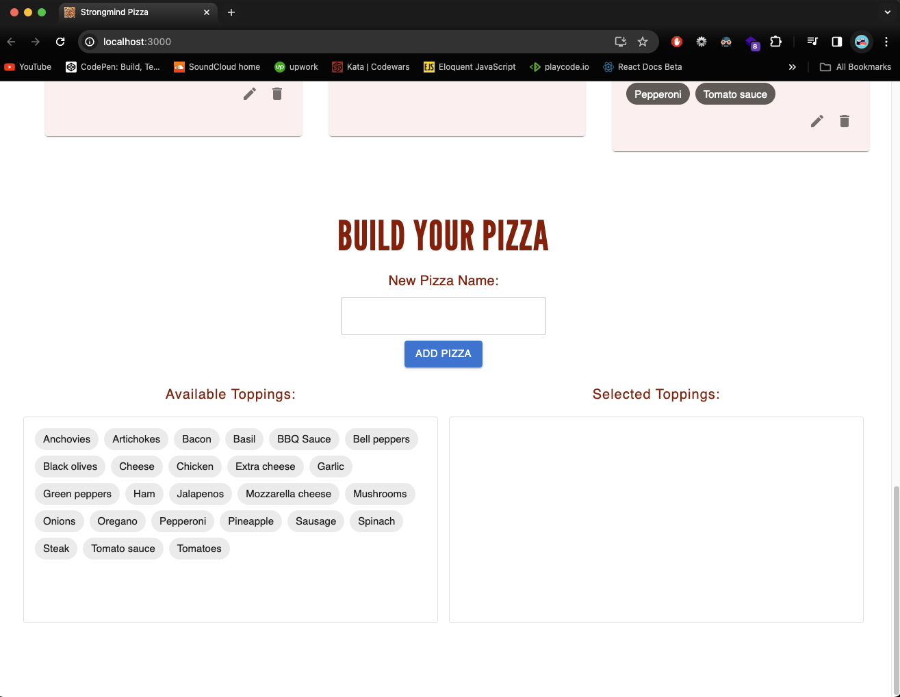
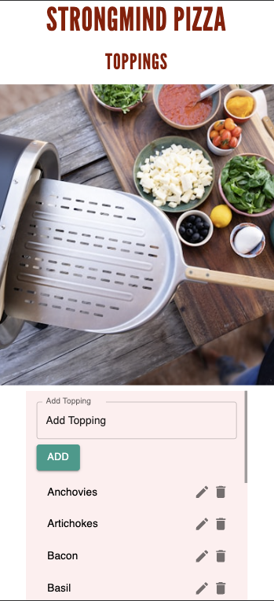
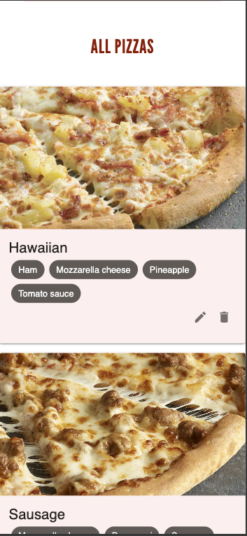
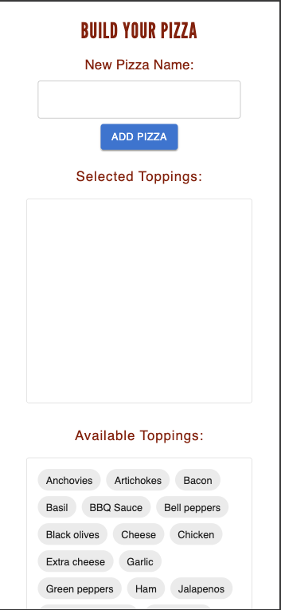

# StrongMind Pizza

## Description

This project serves as a comprehensive skills test designed for candidates applying for the Full Stack Engineer position at StrongMind. The test assesses candidates' proficiency in developing web applications.

The project is structured to evaluate candidates' abilities in:

Developing a front end, back end, database and having the application hosted online following the below requirements for functionality. 

## Project Requirements

1. Manage Toppings

    As a pizza store owner I should be able to manage toppings available for my pizza chefs.• It should allow me to see a list of available toppings.

    - It should allow me to add a new topping.
    - It should allow me to delete an existing topping.
    - It should allow me to update an existing topping.
    - It should not allow me to enter duplicate toppings.

2. Manage Pizzas

    As a pizza chef I should be able to create new pizza master pieces• It should allow me to see a list of existing pizzas and their toppings.


    - It should allow me to create a new pizza and add toppings to it.
    - It should allow me to delete an existing pizza.
    - It should allow me to update an existing pizza.
    - It should allow me to update toppings on an existing pizza.
    - It should not allow me to enter duplicate pizzas.

## Prerequisites

Before running the project, ensure you have the following installed:

1. Node.js and npm (Node Package Manager)
2. MongoDB
    - Recommend using MongoDB Atlas which was used for the project by owner. [MongoDB Atlas](https://www.mongodb.com/cloud/atlas/register)


## Installation

1. Clone the repository:

    ```bash
    git clone https://github.com/aidenmayoros/strongmind_challenge.git
    ```

2. Navigate to the project directory:

    ```bash
    cd your-project-location
    ```

3. Install dependencies for both frontend and backend:

    ```bash
    # Install backend dependencies
    cd backend
    npm install

    # Install frontend dependencies
    cd ../frontend
    npm install
    ```

## Configuration

1. Database Configuration: 

    - Create a account on MongoDB Atlas if you dont have one already. 
    - Create a new Project and Cluster. You can follow [How to Set Up a MongoDB Cluster](https://www.mongodb.com/basics/clusters/mongodb-cluster-setup)
    - Configuration when making the project was `Shared Cluster` - `AWS Cloud provider` - `M0 Sandbox Cluster Tier`.
    - __When creating your cluster make sure you save the username and password before saving for the created user on cluster.__
    - Make sure your IP address is listed to have access to the Database.
    - Once Cluster is created click on `Connect`.
    - Select `Drivers` - Driver should be Node.js, make sure the ODM/ORM Library has Mongoose selected. 
    Version 7.0 or later and run the npm command showing `npm install mongoose`.
    - Copy the connection string and edit it to have your account password and save it as we will need it later. Example: `mongodb+srv://username:<password>@examplecluster0.kxcbhkc.mongodb.net/?retryWrites=true&w=majority`

1. Backend Configuration:

  - Configure files:

    - Create in the root folder a .env file. Inside of this file make a single variable called `MONGOOSE_PASSWORD=<your-cluster-password>` and replace the password with your own from the created user when you made your cluster. 

2. Frontend Configuration:

    - No additional configuration is required for the frontend in most cases.

## Running the Application

1. Start the backend server:

    ```bash
    # Navigate into the project directory
    cd project

    # Navigate to the backend directory
    cd backend

    # Start the server
    node index.js
    ```

    The backend server should now be running on `http://localhost:3001`.

    - Note - You can change the port if you wish but the front end will be running on port 3000 so we made the backend run on 3001 to not run into conflicts.

2. Start the frontend development server:

    - __You will need to run a second terminal to leave the backend running.__

    ```bash
    # Open a new terminal

    # Navigate to project directory
    cd project

    # Navigate to the frontend directory
    cd frontend

    # Start the development server
    npm start
    ```

    The frontend development server should now be running on `http://localhost:3000` and will open automatically in your default web browser.

## Usage

You will need to have first the backend running in a terminal, and then start and run the frontend in another terminal. Once your frontend opens and runs you should be able to see all the data from the backend into the respective areas. You should be able to run CRUD operations and you should be able to save new toppings and create new pizzas.

## Site Screenshots





## Mobile Screenshots




